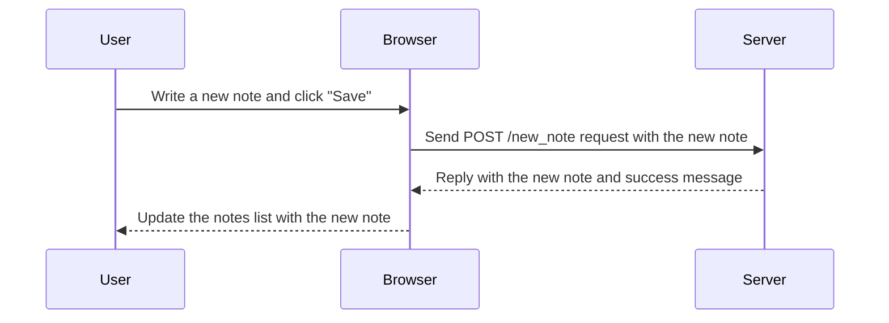

```mermaid
sequenceDiagram
    participant User
    participant Browser
    participant Server

    User->>Browser: Write a new note and click "Save"
    Browser->>Server: Send POST /new_note request with the new note
    Server-->>Browser: Reply with the new note and success message
    Browser-->>User: Update the notes list with the new note
```
