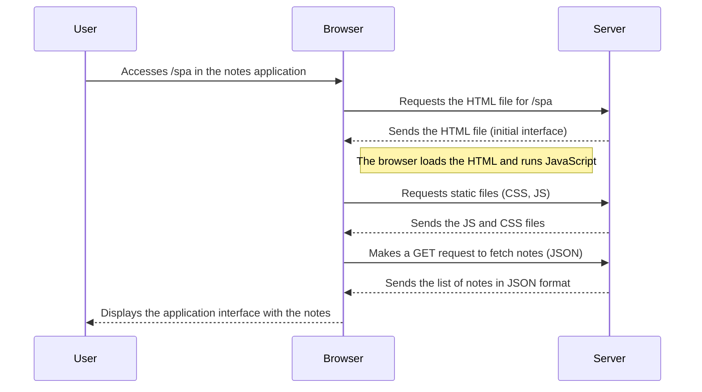

```mermaid
sequenceDiagram
    participant User
    participant Browser
    participant Server

    User->>Browser: Accesses /spa in the notes application
    Browser->>Server: Requests the HTML file for /spa
    Server-->>Browser: Sends the HTML file (initial interface)
    Note right of Browser: The browser loads the HTML and runs JavaScript

    Browser->>Server: Requests static files (CSS, JS)
    Server-->>Browser: Sends the JS and CSS files

    Browser->>Server: Makes a GET request to fetch notes (JSON)
    Server-->>Browser: Sends the list of notes in JSON format
    
    Browser-->>User: Displays the application interface with the notes
```
