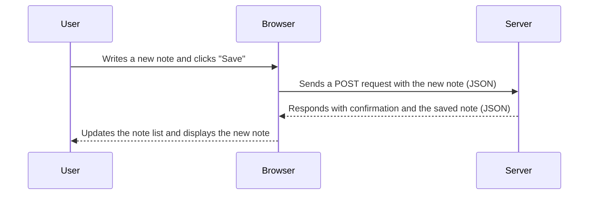

```mermaid
sequenceDiagram
    participant User
    participant Browser
    participant Server

    User->>Browser: Writes a new note and clicks "Save"
    Browser->>Server: Sends a POST request with the new note (JSON)
    Server-->>Browser: Responds with confirmation and the saved note (JSON)

    Browser-->>User: Updates the note list and displays the new note
```
